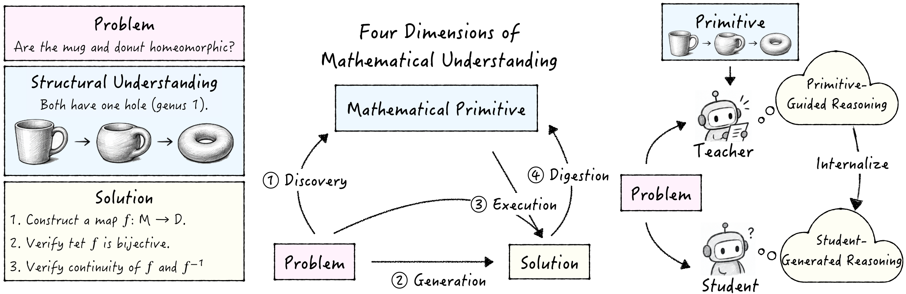

# The Missing Primitive: Diagnosing and Repairing Mathematical Reasoning in Large Language Models


This repository provides the **Prim** benchmark, its evaluation and scoring pipelines, and the **Absorb** training pipeline of the paper [The Missing Primitive: Diagnosing and Repairing Mathematical Reasoning in Large Language Models](https://taco-group.github.io/Math-Primitive/).

<div id="top" align="center">

[](https://taco-group.github.io/Math-Primitive/)

[](https://huggingface.co/datasets/shuoxing/Prim)
[](#-model)
<!-- Uncomment when the arXiv version is out:
[](https://arxiv.org/abs/ARXIV_ID)
-->

</div>

<div align="center">
  
  <p><em>Figure 1. Outline of our work: (i) A <b>mathematical primitive</b> is the essential structural observation that reveals <i>why</i> a problem can be solved; (ii) <b>Prim</b> decomposes mathematical understanding into four dimensions: Discovery, Generation, Digestion and Execution; (iii) <b>Absorb</b> internalizes primitive-guided reasoning: a primitive-conditioned teacher supervises the student's own reasoning, and the student needs no primitive at inference time.</em></p>
</div>

## 🔍 Key Highlights

- **Mathematical Primitives and the Prim Benchmark:** A primitive is the concise, problem-specific observation that reveals *why* a problem can be solved, such as an invariant, a theorem condition, a representation, a reduction or a reformulation. Prim pairs 182 research-level problems from Humanity's Last Exam with expert-verified primitives and evaluates four dimensions: **Discovery** π(x) → p̂, **Generation** π(x) → ŷ, **Digestion** π(x, y) → p̂ and **Execution** π(x, p) → ŷ.

- **Answer Accuracy Masks Distinct Capability Profiles:** Models with similar Generation accuracy can differ by over 30 points in Discovery. Across 12 open- and closed-source models, providing the gold primitive raises accuracy by 17.6 to 29.7 points, so a large part of execution capacity is latent.

- **Discovery Is the Dominant Bottleneck:** Models recover the primitive from a correct solution far better than they find it alone (Qwen3.6-27B: 24.7% Discovery vs. 92.3% Digestion), and 83.6% of Generation failures come with a failed Discovery. Discovery-limited failures are about three times more repairable by post-training than failures where the model can neither discover nor execute.

- **Absorb Repairs Reasoning without Primitives at Inference:** Absorb is a primitive-privileged self-distillation method. The teacher is the model itself conditioned on the primitive, a bounded override transfers its guidance along the student's own trajectory, and the student never sees a primitive at inference time. Absorb consistently outperforms SFT and OPSD across Qwen3.5-4B/9B/27B on Prim, HLE Math, HMMT25 and Omni-MATH.

## 📰 News
- **[2026/09/30]** 🔥We released **The Missing Primitive**, together with the **Prim** benchmark, the **Absorb** training code and the Absorb models on Hugging Face. Explore our [website](https://taco-group.github.io/Math-Primitive/) for more details.


## 🚀 Installation

```bash
git clone https://github.com/taco-group/Math-Primitive.git
cd Math-Primitive
conda create -n absorb python=3.13 -y
conda activate absorb
pip install -r requirements.txt          # or requirements-lock.txt for the exact environment we used
```

Inference needs only `vllm`, `openai`, `datasets` and `pydantic`. Training needs the full stack.
`trl==1.7.0` matters: the trainer imports `trl.experimental.gold.GOLDConfig`, which moved
between TRL versions.

Set these environment variables before running the corresponding steps:

| Variable | Needed for | Required? |
|---|---|---|
| `OPENAI_API_KEY` | Scoring: `eval/judge_answer.py`, `eval/judge_primitive.py` and `eval/judge_all.sh` call the OpenAI API (`o3-mini-2025-01-31` and `gpt-5.4`) | Yes, for scoring. Judging is billed to this key. |
| `PRIM_API_KEY` | Inference against a hosted, OpenAI-compatible model instead of a local vLLM server | Only in that case. Local vLLM needs no key. |

```bash
export OPENAI_API_KEY=...     # scoring
export PRIM_API_KEY=...       # optional: inference on a hosted model
```

Inference on a local vLLM server and training need no API key.

## 🗂️ Repository Layout

```
Math-Primitive/
├── eval/                      # Prim inference, judging and scoring
│   ├── generation.py          #   Generation: solve the problem directly
│   ├── discovery.py           #   Discovery: write the primitive from the problem alone
│   ├── digestion.py           #   Digestion: write the primitive from the problem + a correct solution
│   ├── execution.py           #   Execution: solve the problem given the gold primitive
│   ├── prompts.py             #   Discovery / Digestion / Execution prompts + output schema
│   ├── common.py              #   data loading, answer extraction, resumable JSONL I/O
│   ├── judge_answer.py        #   HLE judge for Generation / Execution (OpenAI API)
│   ├── judge_primitive.py     #   primitive judge for Discovery / Digestion (OpenAI API)
│   ├── judge_prompts.py       #   judge prompts and schemas
│   ├── score.py               #   Prim metrics from the judged files
│   ├── judge_all.sh           #   judge + score one model
│   ├── serve.sh               #   vLLM server wrapper
│   └── run_all.sh             #   inference for all four dimensions, one model
├── train/                     # Absorb, as drop-in files for the OPSD codebase
│   ├── opsd_train.py          #   entrypoint (replaces OPSD's)
│   ├── opsd_trainer.py        #   trainer (replaces OPSD's)
│   ├── data_collator.py       #   student / teacher prompts (replaces OPSD's)
│   ├── accelerate_opsd.yaml   #   DeepSpeed ZeRO-2 config
│   ├── run_absorb.sh          #   the training recipe (SIZE=4B|9B|27B)
│   └── merge_lora.py          #   merge a LoRA checkpoint for vLLM serving
├── assets/pics/               # figures
├── requirements.txt           # key version pins
└── requirements-lock.txt      # full pip freeze of the environment we used
```

## 📦 Data

We release two datasets on Hugging Face:

| Dataset | Hugging Face | What it is |
|---|---|---|
| Prim | [`shuoxing/Prim`](https://huggingface.co/datasets/shuoxing/Prim) | 182 HLE math problems with gold answers, reference solutions and expert-verified primitives (evaluation) |
| math-phd-qual-709 | [`shuoxing/math-phd-qual-709`](https://huggingface.co/datasets/shuoxing/math-phd-qual-709) | 709 Ph.D. qualifying-exam proof problems with human-written proofs and primitives (Absorb training set) |

```python
from datasets import load_dataset
prim  = load_dataset("shuoxing/Prim", split="test")                   # 182 rows
quals = load_dataset("shuoxing/math-phd-qual-709", split="train")    # 709 rows
```

Both datasets contain only the fields below; `solution` and `family` exist only in Prim, where
Digestion and the per-family breakdown need them.

```python
{
  "question": str,
  "answer":   str,
  "solution": str,                # Prim only: the reference solution shown in Digestion
  "family":   str,                # Prim only: "Recast" | "Witness" | "Argument"
  "primitive": {
      "essential_property": str,  # the structural property that makes the problem tractable
      "solution_principle": str,  # how that property connects to a valid solution principle
      "core_concept":       str,  # the primitive in 1-3 sentences, no equations, no answer
  },
}
```

**Prim.** We sample 200 text-only, free-form (`exactMatch`) math problems from the Gold and
Revision subsets of HLE-Verified. GPT-5.4 drafts a primitive for each problem from the problem,
reference answer and gold rationale. Three human experts with graduate-level training in
mathematics then review every primitive and verify the problem, answer and rationale. This
excludes 18 unsuitable problems, leaving 182, and corrects the official answer of 15 retained
problems. `solution` is the reference solution (the gold rationale, as revised by the experts
where they corrected it). Prim is derived from Humanity's Last Exam; please keep it out of
training corpora (the canary string is in the dataset card).

**math-phd-qual-709.** Open-ended proof problems from mathematics Ph.D. qualifying exams,
1991–2026: University of Oregon 332, UW Madison 131, Harvard 126, UC Berkeley 120. By domain:
Algebra 318, Analysis 206, Topology 97, Geometry 82, Number Theory 5, Logic 1. `answer` is the
human-authored proof (median 118 words). The primitive was extracted from that proof with the
same curation prompt as Prim. Absorb conditions the teacher on `primitive.core_concept`, a
one-sentence primitive.

## 🤗 Model

We release our **Absorb** models trained from three Qwen3.5 base models (_Qwen3.5-4B_, _Qwen3.5-9B_, _Qwen3.5-27B_) on Hugging Face:

| Model | Hugging Face | Base model (pinned revision) |
|---|---|---|
| qwen-3.5-4b-absorb | [`shuoxing/qwen-3.5-4b-absorb`](https://huggingface.co/shuoxing/qwen-3.5-4b-absorb) | `Qwen/Qwen3.5-4B` @ `851bf6e8` |
| qwen-3.5-9b-absorb | [`shuoxing/qwen-3.5-9b-absorb`](https://huggingface.co/shuoxing/qwen-3.5-9b-absorb) | `Qwen/Qwen3.5-9B` @ `c2022362` |
| qwen-3.5-27b-absorb | [`shuoxing/qwen-3.5-27b-absorb`](https://huggingface.co/shuoxing/qwen-3.5-27b-absorb) | `Qwen/Qwen3.5-27B` @ `fc05daec` |

Each model is the base checkpoint with the Absorb LoRA merged into the language tower, after one
epoch over the 709 training problems. The layout is unchanged
(`Qwen3_5ForConditionalGeneration`, vision tower copied as is), so every tool that serves the
base model serves these.

**Serving notes:**

- Serve with vLLM and **do not pass `--reasoning-parser`**. The scripts read the thinking trace
  and the answer from `message.content`, and a reasoning parser moves them elsewhere.
- If a model does not fit on one GPU, use tensor parallelism (`TP=2` with `eval/serve.sh`, or
  `--tensor-parallel-size 2`).
- Sampling defaults come from each checkpoint. The 4B and 9B ship no `generation_config.json`
  (vLLM defaults: temperature 1.0, top-p 1.0). The 27B keeps the base model's
  `generation_config.json` (temperature 0.6, top-p 0.95, top-k 20). The eval scripts do not
  override these, which matches how the models were evaluated.

## 📊 Evaluation

Prim decomposes mathematical reasoning into four dimensions. With problem *x*, primitive *p* and
solution *y*: **Discovery** π(x) → p̂, **Generation** π(x) → ŷ, **Digestion** π(x, y) → p̂ and
**Execution** π(x, p) → ŷ. Evaluation has two steps: inference with a local vLLM server, then
judging with the OpenAI API (see [Scoring](#scoring)).

| Dimension | Model is given | Model produces | Script | Serve `--max-model-len` | Token budget | Other settings |
|---|---|---|---|---|---|---|
| Generation | the problem, with HLE's answer-format system prompt | an answer | `eval/generation.py` | 131072 | 120000 | 1 draw |
| Discovery | the problem only | a primitive, as JSON via structured output | `eval/discovery.py` | 40960 | 32768 | `reasoning_effort=high`; one retry if the output states the answer |
| Digestion | the problem and a correct solution | a primitive, as JSON via structured output | `eval/digestion.py` | 40960 | 32768 | `reasoning_effort=high`; single attempt |
| Execution | the problem and the gold primitive | a derivation ending in `## Final Answer` | `eval/execution.py` | 131072 | 120000 | `reasoning_effort=high` |

### Quick start

```bash
# all four dimensions for one model: starts vLLM, restarts it at 40960 for Discovery and Digestion
CUDA_VISIBLE_DEVICES=0 bash eval/run_all.sh shuoxing/qwen-3.5-9b-absorb qwen-3.5-9b-absorb
# 27B with tensor parallelism across two GPUs
CUDA_VISIBLE_DEVICES=0,1 TP=2 bash eval/run_all.sh shuoxing/qwen-3.5-27b-absorb qwen-3.5-27b-absorb
# a base model, for comparison
CUDA_VISIBLE_DEVICES=0 bash eval/run_all.sh Qwen/Qwen3.5-9B qwen3.5-9b
```

Outputs land in `results/<served-name>/{generation,discovery,digestion,execution}.jsonl` and logs in
`results/<served-name>/logs/`.

### Running the tasks by hand

```bash
bash eval/serve.sh shuoxing/qwen-3.5-9b-absorb qwen-3.5-9b-absorb 131072 8000 &
python eval/generation.py --model qwen-3.5-9b-absorb --base-url http://localhost:8000/v1
python eval/execution.py  --model qwen-3.5-9b-absorb --base-url http://localhost:8000/v1
# restart the server with --max-model-len 40960, then
python eval/discovery.py  --model qwen-3.5-9b-absorb --base-url http://localhost:8000/v1
python eval/digestion.py  --model qwen-3.5-9b-absorb --base-url http://localhost:8000/v1
```

- **Resume.** Every script resumes. Re-running the same command fills in only missing or
  failed rows; failed requests are never recorded as done.
- **Several servers.** `--base-url` takes a comma-separated list and spreads requests over it.
- **Smoke test.** `--limit N` runs only the first N problems.
- **Default server.** Without `--base-url`, the scripts use `PRIM_BASE_URL`, or
  `http://localhost:8000/v1` if that is unset.
- **API models.** The scripts talk OpenAI protocol. To evaluate a hosted model, pass its
  `--base-url` and set `PRIM_API_KEY`; local vLLM servers need no key.

### Output rows

| Script | Key fields |
|---|---|
| `generation.py` | `idx`, `question`, `answer` (gold), `response` (full text), `pred` (last `Answer:` line), `finish_reason`, `usage` |
| `discovery.py`, `digestion.py` | `idx`, `question`, `prediction` (the model's primitive as JSON), `leaked`, `leak_reason`, `attempts`, `raw_response`, `error` |
| `execution.py` | `idx`, `question`, `answer`, `response`, `pred` (the `## Final Answer` block), `finish_reason`, `usage` |

### Scoring

Judging calls the OpenAI API and needs `OPENAI_API_KEY` (see [Installation](#-installation)). The inference
scripts never use that key.

```bash
export OPENAI_API_KEY=...
bash eval/judge_all.sh results/qwen-3.5-9b-absorb      # judge all four outputs, then score
```

or step by step:

```bash
python eval/judge_answer.py    --input results/qwen-3.5-9b-absorb/generation.jsonl
python eval/judge_answer.py    --input results/qwen-3.5-9b-absorb/execution.jsonl
python eval/judge_primitive.py --input results/qwen-3.5-9b-absorb/discovery.jsonl
python eval/judge_primitive.py --input results/qwen-3.5-9b-absorb/digestion.jsonl
python eval/score.py --results results/qwen-3.5-9b-absorb
```

- **Generation and Execution** are graded on the final answer by the official HLE judge
  (`o3-mini-2025-01-31`, prompt verbatim from `centerforaisafety/hle`). One call per response.
- **Discovery and Digestion** are graded against the gold primitive by GPT-5.4 (reasoning effort
  medium), with the reference solution as supporting context. Three calls per problem return
  validity *V* ∈ {0, 1} and two graded verdicts σ_gate, σ_mech ∈ {0, ½, 1}: whether the prediction
  identifies the essential structure, and whether it explains how that structure enables the
  solution. Score = V · σ_gate · (0.6 + 0.4 · σ_mech), and a primitive counts as found when
  Score ≥ 0.8 (PrimitiveAcc).
- `score.py` reports all four dimensions over the 182 problems, where a missing or failed row counts
  as wrong, together with Digestion − Discovery, Execution − Generation, and a breakdown by primitive
  family. It makes no API calls.

Each judge writes `<task>.judged.jsonl` next to its input and resumes from it, so re-running only
judges what is missing.

### Prompts

The Discovery, Digestion and Execution prompts and the structured-output schema are in
`eval/prompts.py`; the HLE answer-format prompt is in `eval/common.py`. The Absorb teacher and
student prompts are in `train/data_collator.py`.

## 🏋️ Training

### Method

Absorb is on-policy self-distillation with the **primitive as privileged information** and a
**bounded override** on the transfer. Teacher and student share the same base model. For each
training problem *x* with primitive *p*:

1. The student samples one solution ŷ to the bare problem, using a vLLM engine colocated with
   the trainer and synchronized after every optimizer step.
2. The teacher, which is the base model with the LoRA adapter disabled and the primitive added to
   its prompt, scores every token of ŷ.
3. The student is trained on its own trajectory with

   L = (1/T) Σ_t Σ_{v ∈ S_t} min{ π̄_S(v | ŷ<t, x) · log[ π̄_S(v | ŷ<t, x) / π̄_T(v | ŷ<t, x, p) ], τ },

   where S_t is the teacher's top-K support (K = 128), π̄ are the distributions renormalized over
   S_t, and τ = 0.06. The reverse KL passes the teacher's positive guidance in full, while the
   one-sided clamp bounds how strongly the teacher can suppress choices the student already favors.

Student prompt (Qwen chat template, non-thinking mode):

```text
Problem: {question}

Please reason step by step, and provide a complete, rigorous proof.
```

Teacher prompt (same template and mode; `{core_concept}` is the primitive):

```text
Problem: {question}

Here is the mathematical primitive for this problem — the essential idea that makes it solvable:
=== Primitive Begin ===
{core_concept}
=== Primitive End ===


This primitive is correct for this problem. Solve the problem by building on it: let it guide your choice of approach, and work out the solution to its conclusion. You may reflect, verify, or reconsider your steps whenever you find it necessary.
```

### Setup

Absorb is implemented on top of [OPSD](https://github.com/siyan-zhao/OPSD). Clone it and copy our
files over it. The three `.py` files replace upstream's files of the same name, and nothing else
in OPSD is changed. We developed against upstream commit `7448751`.

```bash
git clone https://github.com/siyan-zhao/OPSD.git
cd OPSD
git checkout 7448751
cp /path/to/Math-Primitive/train/* .
```

### Run

From inside the OPSD checkout:

```bash
# Qwen3.5-9B on 4 GPUs
SIZE=9B NGPU=4 CUDA_VISIBLE_DEVICES=0,1,2,3 bash run_absorb.sh
# Qwen3.5-4B on 1 GPU
SIZE=4B NGPU=1 CUDA_VISIBLE_DEVICES=0 bash run_absorb.sh
# Qwen3.5-27B on 1 GPU
SIZE=27B NGPU=1 CUDA_VISIBLE_DEVICES=0 bash run_absorb.sh
```

`run_absorb.sh` downloads the pinned base revision, loads `shuoxing/math-phd-qual-709`, and
trains. Gradient accumulation is set to `32 / NGPU` so the effective batch is always 32 (`NGPU`
must divide 32). Training runs one epoch and saves the LoRA adapter to
`runs/absorb_qwen3.5-<size>/`. Extra arguments are passed through to `opsd_train.py`, for
example `--vllm_gpu_memory_utilization 0.35` if the colocated engine runs out of memory.

Then merge the adapter and evaluate the merged model on Prim (see [Evaluation](#-evaluation)):

```bash
python merge_lora.py <base snapshot dir> runs/absorb_qwen3.5-9b merged/absorb-9b
bash /path/to/Math-Primitive/eval/run_all.sh merged/absorb-9b absorb-9b
```

`run_absorb.sh` prints the base snapshot path it used. `merge_lora.py` writes the full Qwen3.5
checkpoint layout (vision tower included), which vLLM needs.

### Hyperparameters

| Setting | Value |
|---|---|
| LoRA | rank 64, alpha 128, dropout 0.05, on all attention and MLP projections incl. the linear-attention projections (`q/k/v/o_proj`, `gate/up/down_proj`, `in_proj_qkv/a/b/z`, `out_proj`) |
| Optimizer | fused AdamW, no weight decay, lr 5e-6, linear schedule, no warmup, gradient clipping 0.1 |
| Batch | per-device 1, effective 32 via gradient accumulation |
| Epochs | 1 |
| Objective | top-K support K = 128, clamp τ = 0.06 (`--beta 1 --top_k_loss 128 --jsd_token_clip 0.06`), fully on-policy (`--lmbda 1`), fixed teacher |
| Rollouts | 1 per problem, temperature 1.0, top-p 0.95, top-k 20, max 4096 completion tokens, context 6144 |
| Chat mode | non-thinking for student and teacher |
| Precision | bf16, gradient checkpointing, seed 42 |

### OPSD baseline

OPSD uses the same recipe with the reference proof as the teacher's privileged context instead
of the primitive:

```bash
SIZE=9B NGPU=4 bash run_absorb.sh --privilege_style solution --run_config opsd_qwen3.5-9b
```

## 📄 License

Code is released under the Apache-2.0 license (see `LICENSE`). `train/opsd_trainer.py`,
`train/opsd_train.py` and `train/data_collator.py` are modified from OPSD and TRL (Apache-2.0).
The models are fine-tuned from Qwen3.5 and follow its Apache-2.0 license.

## 🙏 Acknowledgements

We build on [OPSD](https://github.com/siyan-zhao/OPSD), [TRL](https://github.com/huggingface/trl),
[vLLM](https://github.com/vllm-project/vllm), the Qwen3.5 models,
[Humanity's Last Exam](https://lastexam.ai) and HLE-Verified.

## 📖 Citation
We are more than happy if this code is helpful to your work. If you use our code or extend our work, please consider citing our paper:

```bibtex
@article{xing2026missing,
    title={The Missing Primitive: Diagnosing and Repairing Mathematical Reasoning in Large Language Models},
    author={Xing, Shuo and Dai, Zilin and Qian, Chengyuan and Lin, Fangzhou and Chen, Wenjing and He, Ping and Lu, Pan and Velasquez, Alvaro and Bansal, Mohit and Tu, Zhengzhong},
    journal={arXiv preprint},
    year={2026},
}
```
